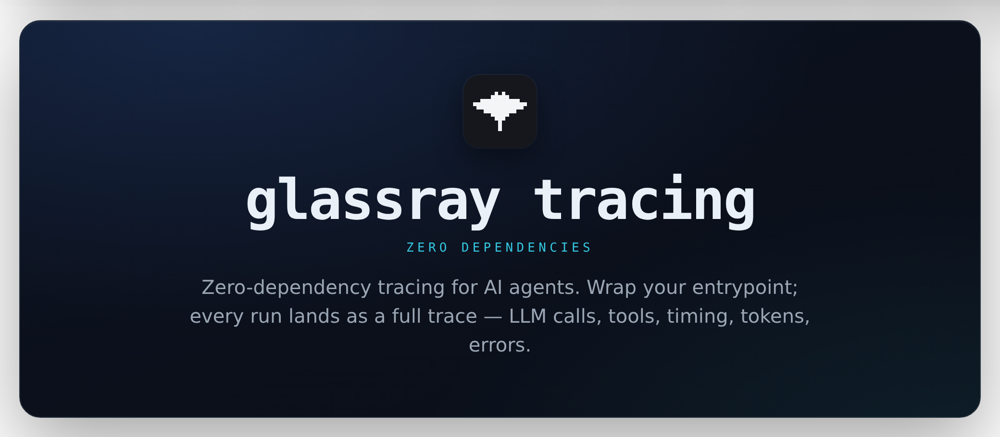

<div align="center">



<p>
  <a href="#quickstart">Quickstart</a> ·
  <a href="#configuration">Configuration</a> ·
  <a href="#reliability">Reliability</a> ·
  <a href="#privacy">Privacy</a> ·
  <a href="https://glassray.ai/docs/sdk-quickstart">Docs</a>
</p>

<p>
  <a href="https://www.npmjs.com/package/@glassray/tracing"></a>
  <a href="https://github.com/glassray/glassray-tracing-js/actions/workflows/ci.yml"></a>
  <a href="https://socket.dev/npm/package/@glassray/tracing"></a>
  <a href="https://packagephobia.com/result?p=@glassray/tracing"></a>
  
</p>

</div>

<!--
  Demo: this is where a recorded GIF belongs — one wrapped function turning into a full
  trace, spans lighting up (LLM calls, tool calls, timing, tokens). Record one and drop it
  in, centered, e.g.:
  <p align="center"></p>
-->

No OpenTelemetry setup, no config file. Wrap your agent, run it, and the trace appears in the
dashboard with every step — then Glassray starts classifying it into flows and scanning for
deviations.

## Quickstart

**1. Install** — zero runtime dependencies, Node ≥ 18:

```sh
pnpm add @glassray/tracing
```

**2. Get a key** — in the [Glassray dashboard](https://app.glassray.ai), go to
**Settings → Sources** and add an **OpenTelemetry** source. Glassray mints a
write-scoped API key and shows it once.

**3. Set it in your agent's environment:**

```sh
export GLASSRAY_API_KEY="sk_..."
```

**4. Wrap your agent:**

```ts
import { Glassray } from "@glassray/tracing";

const glassray = new Glassray();

const result = await glassray.trace("handle-ticket", { customer: "acme-corp" }, async (t) => {
  const plan = await t.llm("plan", { model: "claude-opus-4-8", provider: "anthropic" }, () =>
    anthropic.messages.create(planRequest),
  );
  const docs = await t.tool("search-kb", () => searchKb(plan));
  return await t.llm("answer", { model: "claude-opus-4-8", provider: "anthropic" }, () =>
    anthropic.messages.create(answerRequest),
  );
});
```

**5. Run it** — the trace appears in the dashboard with every step. That's it — no
OpenTelemetry setup, no config file. Full docs: **[glassray.ai/docs](https://glassray.ai/docs/sdk-quickstart)**.

## Why this SDK

- **Zero runtime dependencies** — Node builtins and the global `fetch` only. Published unminified with sourcemaps, so the code on npm is the code you read.
- **Write-only key** — the `sk_…` key carries `traces:write`; code holding it cannot read any data back.
- **Fail-open, always** — every public method is internally guarded. An SDK bug or a Glassray outage costs telemetry at worst, never a blocked or crashed agent.
- **Privacy in layers** — hide switches → scrub-by-default → your `redact()` hook (fail-closed) → per-call opt-out.

## Configuration

Precedence: constructor option > environment variable > default. Invalid config never
throws — the SDK warns and disables itself (fail-open extends to misconfiguration).

| Constructor    | Env var                 | Default                   | What it does                                                                                                                                          |
| -------------- | ----------------------- | ------------------------- | ----------------------------------------------------------------------------------------------------------------------------------------------------- |
| `apiKey`       | `GLASSRAY_API_KEY`      | —                         | Write-only ingest key (`traces:write`). Missing/invalid → warn once, disable sending; your agent runs unaffected.                                     |
| `endpoint`     | `GLASSRAY_ENDPOINT`     | `https://app.glassray.ai` | App origin or full OTLP traces URL. If it doesn't end with `/v1/traces`, the SDK appends `/api/public/otel/v1/traces`. Override for self-hosted instances. |
| `enabled`      | `GLASSRAY_TRACING`      | `true`                    | Kill switch — `GLASSRAY_TRACING=false` disables all tracing.                                                                                          |
| `sampleRate`   | `GLASSRAY_SAMPLE_RATE`  | `1`                       | 0–1. Decided once at trace start, so a trace is always kept or dropped whole.                                                                         |
| `hideInputs`   | `GLASSRAY_HIDE_INPUTS`  | `false`                   | Replace all input content with `[hidden]` — structure, names, timing, tokens still flow.                                                              |
| `hideOutputs`  | `GLASSRAY_HIDE_OUTPUTS` | `false`                   | Same, for output content.                                                                                                                             |
| `scrubbing`    | —                       | `true`                    | Scrub secret-shaped keys (`password`, `api_key`, `token`, …) inside captured I/O.                                                                     |
| `redact`       | —                       | —                         | `(key, value) => value` hook over content attributes. Fail-closed: if it throws, the value is withheld.                                               |
| `agent`        | —                       | —                         | Default metadata on every trace.                                                                                                                       |
| `attributes`   | —                       | —                         | Custom, filterable attributes attached to every trace, e.g. `{ environment: "production", region: "eu" }`. Reserved (`glassray.*` / `gen_ai.*`) keys are dropped. |
| `onWarn`       | —                       | console                   | Receives the SDK's rate-limited warnings instead of the console.                                                                                      |
| —              | `GLASSRAY_DEBUG`        | `false`                   | Verbose diagnostics (queue, transport, drops).                                                                                                        |

Per-trace metadata (`customer`, `sessionId`, `flow`, `traceId`, `attributes`) goes in the second
argument of `glassray.trace(name, meta, fn)` and overrides the constructor defaults. It lands in
Glassray as filterable trace tags.

### Custom attributes

Beyond `customer` / `agent` / `flow`, attach **any** custom attributes and filter your traces by
them in the dashboard — e.g. by `merchantId`, `branch`, or `region`. Set per-process defaults on
the constructor and override (or add) per trace in `meta.attributes`:

```ts
const glassray = new Glassray({
  agent: "support-agent",
  attributes: { region: "eu", tier: "enterprise" }, // resource-level defaults
});

await glassray.trace(
  "handle-ticket",
  { customer: "acme-corp", attributes: { merchantId: "acme", branch: "master" } },
  async (t) => { ... },
);
```

Values are scalar (string / number / boolean). A per-trace key overrides a constructor default of
the same name. Keys under a reserved namespace (`glassray.*`, `gen_ai.*`, and OTel infra prefixes
like `service.*` / `session.*`) are dropped with a warning. High-cardinality id-shaped values
(UUIDs, hashes, long ids) are kept on the wire but not surfaced as filter options.

## Serverless

A trace is POSTed once, when its root settles (success or throw), from a queue that never holds
your process open. So:

| Runtime                          | What you need                                                                            |
| -------------------------------- | ---------------------------------------------------------------------------------------- |
| Long-lived Node (server, worker) | Nothing.                                                                                 |
| Vercel                           | `waitUntil(glassray.flush())` after the response.                                        |
| AWS Lambda                       | `await glassray.flush()` before returning.                                               |
| Cloudflare Workers               | `ctx.waitUntil(glassray.flush())` — needs `nodejs_compat`; Node is the tested path today. |

## Privacy

Content (inputs/outputs) is captured by default — Glassray judges traces on evidence.
Controls, applied in this order:

1. **Hide switches** — `GLASSRAY_HIDE_INPUTS` / `GLASSRAY_HIDE_OUTPUTS` replace content
   with `[hidden]`; structure, timing, and tokens still flow.
2. **Scrub-by-default** — secret-shaped keys inside structured I/O become
   `[scrubbed: …]` placeholders. Off switch: `scrubbing: false`.
3. **Your `redact(key, value)` hook** — fail-closed: a throwing hook withholds the
   value, never leaks it.
4. **Per-call** `captureInput: false` / `captureOutput: false` on any span.

## Reliability

Fail-open, always: every public method is internally guarded — an SDK bug or a Glassray
outage costs telemetry at worst, never a blocked or crashed agent. The bounds are
documented because they're the trust signal:

- Bounded queue: **100 traces / 20 MiB**, drop-oldest with a one-time warning.
- **10 s** request timeout; gzip at ≥ 8 KiB; `429` honors `Retry-After` (at most **3**
  requeues per trace, then dropped); `503`/network errors retried at most **2×** with
  jittered backoff; other 4xx dropped immediately; `401`/`403` warn once and mute the sender.
- Per-field cap **32 KiB** (truncated with an explicit marker); whole-trace soft cap
  **4 MiB** — structure, timing, and tokens always survive truncation.
- No timer or socket holds the process open (everything is `unref`'d).
- `glassray.stats()` → `{ sent, dropped: { byReason }, queued }` for accounting.

## Trust

- The `sk_…` key is **write-only** (`traces:write`) — code holding it cannot read any data back.
- **Zero runtime dependencies** — Node builtins and the global `fetch` only.
- **Zero phone-home** beyond the traces themselves.
- Published unminified with sourcemaps — the code on npm is the code you read.

## Docs

- [Quickstart](https://glassray.ai/docs/sdk-quickstart)
- [Instrumenting your agent](https://glassray.ai/docs/sdk-instrumenting)
- [Configuration reference](https://glassray.ai/docs/sdk-configuration)
- [Privacy & redaction](https://glassray.ai/docs/sdk-privacy)
- [Reliability & serverless](https://glassray.ai/docs/sdk-reliability)
- [Troubleshooting](https://glassray.ai/docs/sdk-troubleshooting)

MIT licensed.
